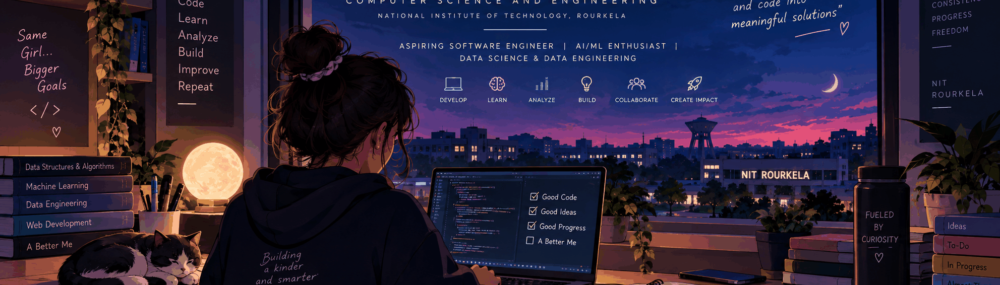

<div align="center">



# 👋 Hi, I'm Kalpita Saha

### `Aspiring Software Engineer` · `AI/ML` · `Data Science & Data Engineering`

<p>
  <a href="https://www.linkedin.com/in/kalpita-saha-414263325/">
    
  </a>
  <a href="mailto:kalpitasaha03@gmail.com">
    
  </a>
</p>

</div>

---

## 🧑‍💻 About Me

🎓 **Computer Science & Engineering** student at **National Institute of Technology, Rourkela**

💻 I am working toward a career in **Software Engineering**, while building strong foundations in **full-stack development, AI/ML, data science, and data engineering**.

📊 I enjoy working with data — from exploratory analysis and machine learning models to SQL-based analytics, warehouse design, and dashboards.

🤖 I am also interested in building practical AI-powered applications and learning how intelligent systems can be integrated into real-world software.

🚀 My goal is to keep learning, building, and turning ideas into useful, reliable solutions.

---

## ⚡ Tech Stack

### Languages
<p>
  
</p>

### Web & Full-Stack Development
<p>
  
</p>

### AI / ML & Data Science

`Python` · `Pandas` · `NumPy` · `Scikit-learn` · `Matplotlib` · `Seaborn`

`Machine Learning` · `NLP` · `TF-IDF` · `Data Analysis` · `Data Visualization`

### Data Engineering & Databases

`SQL` · `MySQL` · `PostgreSQL` · `Prisma` · `Drizzle`

`Data Warehousing` · `Star Schema` · `ETL/ELT` · `Data Quality` · `Analytical SQL`

### AI & Modern Application Infrastructure

`Gemini` · `OpenAI` · `LangChain` · `Chroma` · `Redis` · `BullMQ`

`REST APIs` · `Socket.IO` · `JWT` · `Docker`

---

## 🚀 Featured Projects

<table>
<tr>
<td width="50%" valign="top">

### 🤖 AI Learning Path Generator

An AI-powered learning platform that generates personalized learning paths based on a user's goals, experience, learning style, and available study time.

**Highlights**

- Personalized learning paths
- AI-powered assistant/chat
- RAG and vector search
- Resource discovery
- Progress tracking
- Background processing

**Stack:** React · Vite · Flask · PostgreSQL · Redis/RQ · Gemini · LangChain · Chroma · Docker

</td>

<td width="50%" valign="top">

### 👥 Collaborative Todo

A full-stack collaborative task management platform designed for organizations and teams.

**Highlights**

- Authentication & authorization
- Multi-organization workflows
- Role-based access control
- Real-time collaboration
- Comments & attachments
- Notifications & reminders
- Background jobs

**Stack:** React · TypeScript · Node.js · Express · PostgreSQL · Prisma · Redis · BullMQ · Socket.IO · Docker

</td>
</tr>

<tr>
<td width="50%" valign="top">

### 📊 Olist Analytics Warehouse

An analytics warehouse project built around 100K+ Brazilian e-commerce orders, focused on business intelligence, customer retention, delivery performance, and seller analysis.

**Highlights**

- MySQL data warehouse
- Staging → transformation → reporting pipeline
- Star schema
- Data-quality checks
- Retention & cohort analysis
- Seller performance analysis
- Streamlit dashboard

**Stack:** MySQL · SQL · Python · Pandas · SciPy · Streamlit

</td>

<td width="50%" valign="top">

### 📰 Fake News Detection

A machine learning project for classifying news articles using natural language processing and multiple classification models.

**Highlights**

- Text preprocessing
- Stop-word removal
- Lemmatization
- TF-IDF vectorization
- Model comparison
- Confusion matrices & evaluation

**Models:** Logistic Regression · Decision Tree · Random Forest · Gradient Boosting

**Stack:** Python · Pandas · Scikit-learn · NLTK · Matplotlib · Seaborn

</td>
</tr>

<tr>
<td width="50%" valign="top">

### 🍔 Campus Eats

A campus-focused food ordering web application designed to make ordering food from campus restaurants simple and convenient.

**Highlights**

- Restaurant/food browsing
- User login
- Ordering workflow
- Confirmation flow
- Responsive web interface

**Stack:** HTML · CSS · JavaScript

</td>


</tr>
</table>

---

## 🧠 Areas I'm Exploring

```text
Software Engineering      ████████████████████
AI / Machine Learning     ██████████████████
Data Science              ██████████████████
Data Engineering          █████████████████
Full-Stack Development    ████████████████
SQL & Analytics           ███████████████████
```

---

## 🎯 Current Focus

- 💻 Strengthening software engineering fundamentals
- 🤖 Learning more about AI/ML and NLP
- 📊 Deepening data science and analytical skills
- 🏗️ Learning data warehouse and data engineering concepts
- 🗄️ Improving SQL and database design
- 🌐 Building scalable full-stack applications
- 🐳 Learning Docker and modern development workflows
- 🧩 Improving problem-solving and DSA

---

## 📊 GitHub Analytics

<div align="center">

<a href="https://github.com/Kolpi03">
  
</a>
<a href="https://github.com/Kolpi03">
  
</a>

<br/>

<a href="https://github.com/Kolpi03">
  
</a>

</div>

---

## 🌱 My Development Journey

```text
Learn
  ↓
Build
  ↓
Break
  ↓
Debug
  ↓
Understand
  ↓
Improve
  ↓
Build Better
```

> **Learning never stops. Every project is another step forward.**

---

## 🌐 Let's Connect

<div align="center">

<a href="https://www.linkedin.com/in/kalpita-saha-414263325/">
  
</a>

<a href="mailto:kalpitasaha03@gmail.com">
  
</a>

</div>

---

<div align="center">

### 💙 Learn. Build. Analyze. Create.

⭐ Thanks for visiting my profile!

</div>
